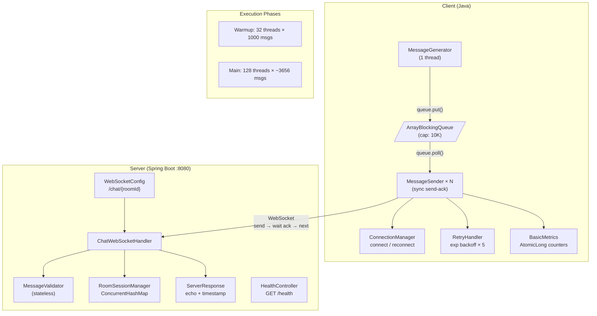
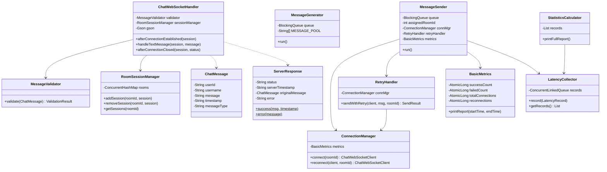

# ChatFlow Design Document

## 1. Architecture Overview

The system consists of a Spring Boot WebSocket server and a multithreaded Java client following a producer-consumer pattern.

```
┌─────────────────────────────────────────────────────────────────┐
│                        CLIENT                                   │
│                                                                 │
│  ┌──────────────┐     ┌──────────────┐    ┌──────────────────┐  │
│  │  Message     │     │ ArrayBlocking│    │  MessageSender   │  │
│  │  Generator   │────>│ Queue        │───>│  × N threads     │  │
│  │  (1 thread)  │     │ (cap: 10K)   │    │  (1 conn each)   │  │
│  └──────────────┘     └──────────────┘    └────────┬─────────┘  │
│                                                    │            │
│  ┌───────────────┐  ┌──────────────┐  ┌────────────┴──────────┐ │
│  │ BasicMetrics  │  │ RetryHandler │  │ ConnectionManager     │ │
│  │ AtomicLong    │  │ exp backoff  │  │ connect / reconnect   │ │
│  └───────────────┘  └──────────────┘  └───────────────────────┘ │
└─────────────────────────────────────────────────────────────────┘
                              │
                    WebSocket (persistent)
                    ws://host:8080/chat/{roomId}
                              │
┌─────────────────────────────────────────────────────────────────┐
│                        SERVER (Spring Boot)                     │
│                                                                 │
│  ┌───────────────┐    ┌──────────────┐    ┌──────────────────┐  │
│  │ WebSocket     │    │ ChatWebSocket│    │  Message         │  │
│  │ Config        │───>│ Handler      │───>│  Validator       │  │
│  │ /chat/{room}  │    │ (core)       │    │  (stateless)     │  │
│  └───────────────┘    └──────┬───────┘    └──────────────────┘  │
│                             │                                   │
│  ┌──────────────┐    ┌──────┴───────┐    ┌───────────────────┐  │
│  │ Health       │    │ RoomSession  │    │  ServerResponse   │  │
│  │ Controller   │    │ Manager      │    │  echo + timestamp │  │
│  │ GET /health  │    │ ConcurrentMap│    │                   │  │
│  └──────────────┘    └──────────────┘    └───────────────────┘  │
└─────────────────────────────────────────────────────────────────┘
```




## 2. Major Classes and Relationships




**Server Module:**

| Class                  | Responsibility                                               |
| ---------------------- | ------------------------------------------------------------ |
| `ChatWebSocketHandler` | Core handler — `afterConnectionEstablished()`, `handleTextMessage()`, `afterConnectionClosed()`. Delegates to Validator and SessionManager. |
| `MessageValidator`     | Stateless validation: userId ∈ [1,100000], username 3-20 alphanum, message 1-500 chars, ISO-8601 timestamp, messageType ∈ {TEXT, JOIN, LEAVE}. |
| `RoomSessionManager`   | `ConcurrentHashMap<roomId, Set<WebSocketSession>>` — thread-safe session tracking per room. |
| `ServerResponse`       | Factory methods `success(msg, timestamp)` and `error(message)` for JSON responses. |

**Client Module:**

| Class                          | Responsibility                                               |
| ------------------------------ | ------------------------------------------------------------ |
| `MessageGenerator`             | Single producer thread. Generates random JSON messages into `BlockingQueue`. 50 pre-defined message pool, 90/5/5% type distribution. |
| `MessageSender`                | Consumer thread. Assigned a fixed roomId. Connects once, synchronously sends messages and waits for ack via `CountDownLatch`. |
| `ConnectionManager`            | Creates `ChatWebSocketClient` instances. Handles reconnection on failure. |
| `RetryHandler`                 | Exponential backoff (100ms × 2^attempt) up to 5 retries. Returns `SendResult` with success/fail and possibly reconnected client. |
| `BasicMetrics`                 | Four `AtomicLong` counters: success, failed, connections, reconnections. |
| `LatencyCollector` (Part2)     | `ConcurrentLinkedQueue<LatencyRecord>` — zero-lock collection of per-message latency data. |
| `StatisticsCalculator` (Part2) | Computes mean, median, p95, p99, min, max. Prints per-room throughput and message type distribution. |

## 3. Threading Model

```
Phase 1 — Warmup:
  1 Generator thread ──> BlockingQueue ──> 32 Sender threads (each sends 1000 msgs)
  
Phase 2 — Main:
  1 Generator thread ──> BlockingQueue ──> 128 Sender threads (remaining 468K msgs)
```

**Each sender thread operates independently:**

```
connect(roomId) → loop { poll(queue) → send(msg) → await(ack) → record metrics } → close()
```

Key design decisions:

- **Fixed room assignment**: Each sender binds to one room (`i % 20 + 1`), maintaining a single persistent WebSocket connection throughout its lifetime. This eliminates connection churn from random room switching.
- **Synchronous send-ack**: Each thread sends one message and blocks until the server echoes back. `CountDownLatch(1)` coordinates between the sender thread (calls `await()`) and the WebSocket IO thread (calls `countDown()` in `onMessage()`).
- **Producer-consumer decoupling**: `ArrayBlockingQueue(10000)` provides natural backpressure — generator blocks when full, senders block when empty.

## 4. WebSocket Connection Management

Each sender thread owns exactly one WebSocket connection:

```
Sender #1 ── persistent conn ── ws://host:8080/chat/1
Sender #2 ── persistent conn ── ws://host:8080/chat/1
Sender #3 ── persistent conn ── ws://host:8080/chat/2
  ...
Sender #128 ── persistent conn ── ws://host:8080/chat/8
```

Connections are not shared between threads — this avoids the ack-routing problem where multiple threads on one connection can't determine which response belongs to which request. Reconnection happens only on connection drop, handled by `RetryHandler` with exponential backoff.

## 5. Little's Law Analysis

**Little's Law: λ = L / W**

Where L = concurrent threads, W = round-trip time, λ = throughput.

### Predictions vs Actual Results

| Environment      | L (threads) | W (RTT)           | Predicted λ    | Actual λ       | Accuracy |
| ---------------- | ----------- | ----------------- | -------------- | -------------- | -------- |
| **Local**        | 128         | ~2.5ms (measured) | 51,200 msg/sec | 47,683 msg/sec | 93%      |
| **EC2** (warmup) | 32          | ~26ms (measured)  | 1,231 msg/sec  | 1,224 msg/sec  | 99%      |
| **EC2** (main)   | 128         | ~26ms (measured)  | 4,923 msg/sec  | 4,119 msg/sec  | 84%      |

The local prediction is very accurate. EC2 main phase shows ~16% deviation, attributable to t2.micro CPU constraints and network jitter at higher concurrency.

### Performance Comparison

| Metric                 | Local          | EC2 (us-west-2) |
| ---------------------- | -------------- | --------------- |
| Throughput             | 47,683 msg/sec | 3,578 msg/sec   |
| Mean RTT               | 2.34 ms        | 27.82 ms        |
| Median RTT             | 2 ms           | 24 ms           |
| p95                    | 4 ms           | 98 ms           |
| p99                    | 5 ms           | 113 ms          |
| Max                    | 93 ms          | 205 ms          |
| Total time (500K msgs) | 10.5 sec       | 139.8 sec       |

The ~13× throughput reduction from local to EC2 directly corresponds to the ~12× increase in RTT (2.3ms → 28ms), confirming that network latency is the dominant bottleneck — not server processing capacity.