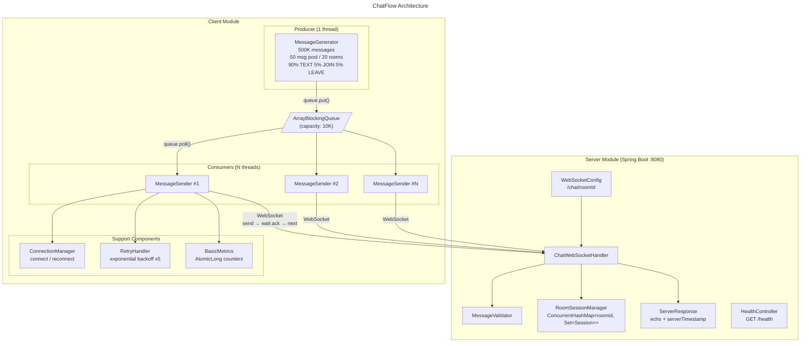
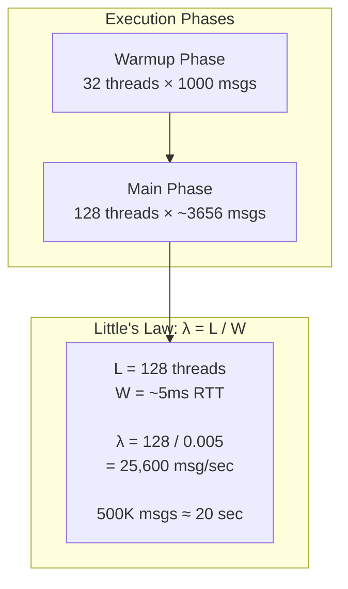

# ChatFlow - Distributed Chat System

CS6650 Assignment 1: WebSocket Chat Server and Multithreaded Client

## Prerequisites

- Java 17+
- Maven 3.8+
  title: ChatFlow Architecture
---





```
chatflow/
├── server/          # Spring Boot WebSocket server
├── client-part1/    # Basic load testing client
├── client-part2/    # Client with performance analysis
└── results/         # Test results and analysis
```

## 
## Project Structure

```
chatflow/
├── server/          # Spring Boot WebSocket server
├── client-part1/    # Basic load testing client
├── client-part2/    # Client with performance analysis
└── results/         # Test results and analysis
```

## Build

```bash
# Build all modules
mvn clean package

# Build specific module
mvn clean package -pl server
```

## Run

### Server

```bash
cd server
mvn spring-boot:run
# Or after packaging:
java -jar target/server-1.0-SNAPSHOT.jar
```

Server starts on port 8080:
- WebSocket: `ws://localhost:8080/chat/{roomId}`
- Health check: `http://localhost:8080/health`

### Client Part 1

```bash
# Make sure server is running first
cd client-part1
mvn exec:java -Dexec.mainClass="com.chatflow.client.ClientApp"
# Or after packaging:
java -jar target/client-part1-1.0-SNAPSHOT.jar
```

### Client Part 2

```bash
cd client-part2
java -jar target/client-part2-1.0-SNAPSHOT.jar
```

## Test

```bash
# Run all tests
mvn test

# Run tests for specific module
mvn test -pl server
```

## Quick Verify with wscat

```bash
# Install wscat
npm install -g wscat

# Connect to room 1
wscat -c ws://localhost:8080/chat/1

# Send a message
{"userId":"1","username":"testuser","message":"hello","timestamp":"2024-01-01T00:00:00Z","messageType":"TEXT"}
```
