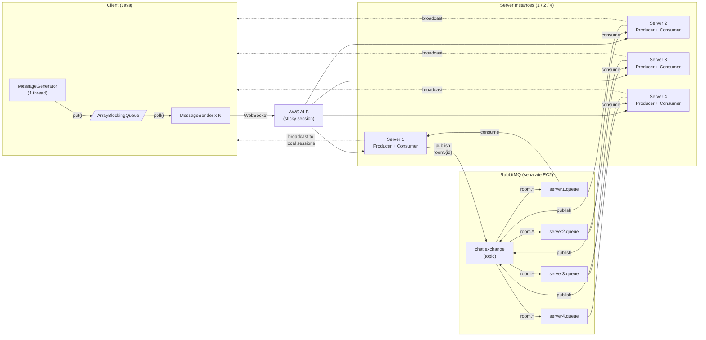
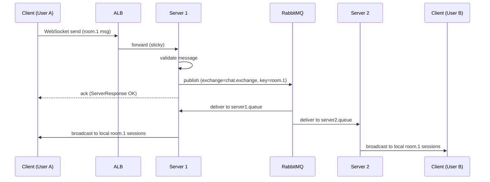

# ChatFlow Design Document — CS6650 Assignment 2

Git Repository URL：[](https://github.com/YskiGPG/ChatFlow)

## 1. System Architecture Diagram



Each Server is both **producer** (publishes to RabbitMQ on message receive) and **consumer** (subscribes to its own exclusive queue, broadcasts to local WebSocket sessions). Every Server binds its queue to `room.*`, so all Servers receive all messages and broadcast only to sessions they hold locally.

## 2. Message Flow Sequence Diagram



## 3. Queue Topology Design

```
chat.exchange (topic)
    │
    ├── binding: room.* ──> server1.queue (exclusive, auto-delete)
    ├── binding: room.* ──> server2.queue (exclusive, auto-delete)
    ├── binding: room.* ──> server3.queue (exclusive, auto-delete)
    └── binding: room.* ──> server4.queue (exclusive, auto-delete)
```

| Parameter | Value | Rationale |
|-----------|-------|-----------|
| Exchange type | topic | Supports room-based routing + wildcard binding |
| Queue per server | 1 exclusive | Auto-deleted when Server disconnects, no stale queues |
| Binding key | `room.*` | Each Server receives all room messages, filters locally |
| Message TTL | 60s | Drop undelivered messages to prevent queue buildup |
| Prefetch count | 64 | Balance throughput vs memory, tuned per test |
| Publisher confirms | enabled | Ensure messages reach RabbitMQ before acking client |

Queue message format adds `messageId` (UUID), `serverId`, and `clientIp` to the original Assignment 1 `ChatMessage` fields for deduplication and tracing.

## 4. Consumer Threading Model

Each Server instance runs an internal consumer module:

```
Server Instance
├── Tomcat NIO threads (handle incoming WebSocket)
│     └── on message: validate → ChannelPool.borrow() → publish → return channel → ack
│
├── RabbitMQ Consumer Threads (configurable: 10~80)
│     └── on delivery: deserialize → RoomSessionManager.getSessions(roomId) → broadcast
│
└── ChannelPool (20 channels, shared Connection)
      └── BlockingQueue<Channel> for thread-safe borrow/return
```

Consumer threads pull from the Server's exclusive queue. On each message, they look up local sessions for that roomId via `RoomSessionManager` and send to each. If no local sessions exist for that room, the message is discarded (another Server will handle it). Manual ack after successful broadcast ensures at-least-once delivery.

**Tuning targets:** consumer threads tested at 10, 20, 40, 80. Goal: queue depth < 1000, consumer lag < 100ms.

## 5. Load Balancing Configuration

| ALB Setting | Value | Rationale |
|-------------|-------|-----------|
| Protocol | HTTP/WebSocket | ALB natively supports WebSocket upgrade |
| Sticky sessions | Enabled (app cookie) | WebSocket requires connection affinity |
| Idle timeout | 120s | Longer than client heartbeat interval |
| Health check path | `/health` | Existing endpoint from Assignment 1 |
| Health check interval | 30s | Balance detection speed vs overhead |
| Healthy threshold | 2 | Quick recovery after transient issues |
| Unhealthy threshold | 3 | Avoid flapping on single missed check |

**Test matrix:**

| Config | Servers | Client threads | Expected throughput |
|--------|---------|---------------|-------------------|
| Baseline | 1 | 128 | ~4,000 msg/s |
| Scale-up | 2 | 256 | ~8,000 msg/s |
| Full | 4 | 512 | ~16,000 msg/s |

## 6. Failure Handling Strategies

| Failure | Detection | Recovery |
|---------|-----------|----------|
| RabbitMQ connection lost | `ShutdownListener` callback | Reconnect with exponential backoff (1s, 2s, 4s...), buffer messages in memory during reconnect |
| Channel error | `Channel.addShutdownListener()` | Remove from pool, create replacement channel |
| Server instance crash | ALB health check fails | ALB routes new connections to healthy servers; exclusive queue auto-deletes |
| Consumer falls behind | Queue depth monitoring | Increase prefetch count and consumer threads dynamically |
| Duplicate messages | `messageId` (UUID) tracking | `ConcurrentHashMap<UUID, timestamp>` with 60s TTL, skip already-seen messages |
| Client disconnect | `afterConnectionClosed()` | Remove session from `RoomSessionManager`, unsubscribe from room queue if last session |

# Test Results

## Single Instance Tests

### Client Output (1 Server)


| Phase               | Messages    | Throughput      | Connections | Reconnections |
| ------------------- | ----------- | --------------- | ----------- | ------------- |
| Warmup (32 threads) | 32,000      | 1,326 msg/s     | 101         | 69            |
| Main (128 threads)  | 460,842     | 4,808 msg/s     | 633         | 570           |
| **Overall**         | **492,842** | **4,108 msg/s** | -           | -             |

### RabbitMQ Management Console


- **Queue depth**: Stable at 0 (consumers keeping up with producers — good plateau profile)
- **Message rates**: Publish and consume rates balanced at 0.00/s post-test
- **Global counts**: 4 connections, 84 channels, 4 queues, 4 consumers


- 4 exclusive queues (one per server instance): `server.server-1.queue` through `server.server-4.queue`
- All queues in running state with 0 messages ready/unacked — no message buildup

## Load Balanced Tests

### Client Output (2 Servers)


| Phase               | Messages    | Throughput      | Connections | Reconnections |
| ------------------- | ----------- | --------------- | ----------- | ------------- |
| Warmup (32 threads) | 32,000      | 1,370 msg/s     | 86          | 54            |
| Main (128 threads)  | 468,000     | 8,661 msg/s     | 306         | 178           |
| **Overall**         | **500,000** | **6,460 msg/s** | -           | -             |

### Client Output (4 Servers)


| Phase               | Messages    | Throughput      | Connections | Reconnections |
| ------------------- | ----------- | --------------- | ----------- | ------------- |
| Warmup (32 threads) | 32,000      | 813 msg/s       | 109         | 77            |
| Main (128 threads)  | 468,000     | 7,302 msg/s     | 277         | 149           |
| **Overall**         | **500,000** | **4,833 msg/s** | -           | -             |

### ALB Metrics


The three peaks in the Request Count chart correspond to the three test runs (1, 2, and 4 servers). Target Response Time peaked at 11.1 seconds during the single-server test, then dropped significantly with 2 and 4 servers, confirming load distribution is effective.

### EC2 Instances


5 instances running: 1 RabbitMQ + 4 server-v2 instances, all t2.micro in us-west-2.

### Performance Improvement Analysis

| Config   | Servers | Throughput  | vs Baseline | Total Time | Failed |
| -------- | ------- | ----------- | ----------- | ---------- | ------ |
| Baseline | 1       | 4,108 msg/s | -           | 120s       | 7,158  |
| Scale-up | 2       | 6,460 msg/s | **+57%**    | 77s        | 0      |
| Full     | 4       | 4,833 msg/s | +18%        | 103s       | 0      |

**Key observations:**

- **1 → 2 servers**: 57% throughput improvement, 100% success rate (vs 98.6% with 1 server). The second server effectively doubled processing capacity while the single RabbitMQ instance could still handle the load.
- **2 → 4 servers**: Throughput decreased from 6,460 to 4,833 msg/s. The bottleneck shifted from server processing to the RabbitMQ instance — 4 servers publishing and consuming through a single t2.micro RabbitMQ creates contention on the queue. Each message is now delivered to 4 exclusive queues (one per server), quadrupling RabbitMQ's fan-out work.
- **Warmup phase** consistently shows lower throughput (~1,300 msg/s with 32 threads), consistent with Little's Law: 32 threads / ~25ms RTT ≈ 1,280 msg/s.
- **Reconnections** are caused by ALB connection management and WebSocket upgrade overhead, not application errors.

------

# Configuration Details

## Queue Configuration

| Parameter           | Value                                               |
| ------------------- | --------------------------------------------------- |
| Exchange name       | `chat.exchange`                                     |
| Exchange type       | topic                                               |
| Queue type          | Classic, exclusive, auto-delete                     |
| Queue naming        | `server.{serverId}.queue` (one per server instance) |
| Binding key         | `room.*` (each server receives all room messages)   |
| Message TTL         | Not set (messages consumed immediately)             |
| Publisher confirms  | Enabled                                             |
| Message persistence | `PERSISTENT_TEXT_PLAIN`                             |

## Consumer Configuration

| Parameter         | Value                                       |
| ----------------- | ------------------------------------------- |
| Prefetch count    | 64                                          |
| Acknowledgment    | Manual (after successful broadcast)         |
| Deduplication     | UUID-based, 60s TTL, ConcurrentHashMap      |
| Consumer threads  | 1 per server (RabbitMQ push-based delivery) |
| Channel pool size | 20 channels per server                      |

## ALB Settings

| Parameter             | Value                              |
| --------------------- | ---------------------------------- |
| Type                  | Application Load Balancer          |
| Scheme                | Internet-facing                    |
| Listener              | HTTP :80                           |
| Target group protocol | HTTP :8080                         |
| Health check path     | `/health`                          |
| Health check interval | 30s                                |
| Healthy threshold     | 2                                  |
| Unhealthy threshold   | 3                                  |
| Sticky sessions       | Enabled (application-based cookie) |
| Cookie name           | `CHATFLOWSESSION`                  |
| Stickiness duration   | 86400s (1 day)                     |
| Idle timeout          | 60s (default)                      |

## Instance Types

| Resource  | Instance      | Count     | Region    |
| --------- | ------------- | --------- | --------- |
| RabbitMQ  | t2.micro      | 1         | us-west-2 |
| Server-v2 | t2.micro      | 1 / 2 / 4 | us-west-2 |
| Client    | Local machine | 1         | -         |
| ALB       | AWS ALB       | 1         | us-west-2 |
